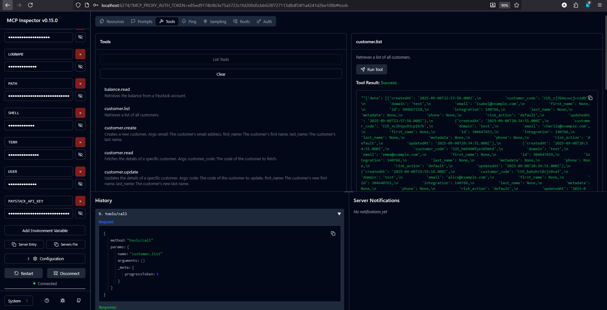

# Paystack MCP Server

This project is a [Model Context Protocol](https://modelcontextprotocol.com/) server for the Paystack API. It provides a set of tools that can be used by AI assistants and other automated systems to interact with Paystack in a structured way. This allows for the automation of tasks suchs as creating customers, managing products, initiating transactions, and many other tasks.


<!--  -->

This server is built using the official `paystack-sdk` for Python and `FastMCP` for the server implementation.

## Features

- A comprehensive set of tools for interacting with the Paystack API.
- Asynchronous by default, built on `FastMCP`.
- Easy to extend with new tools and functionality.
- Includes a `Dockerfile` for easy containerization and deployment.

## Installation

This project uses `uv` for dependency management. To install the necessary packages, follow these steps:

1.  **Clone the repository:**
    ```bash
    git clone https://github.com/thisishaykins/paystack-python-mcp
    cd paystack-python-mcp
    ```

2.  **Create a virtual environment:**
    ```bash
    uv venv
    ```

3.  **Activate the virtual environment:**
    ```bash
    source .venv/bin/activate
    ```

4.  **Install the dependencies:**
    ```bash
    uv pip install -e .
    ```

## Setup

To use the Paystack MCP server, you need to provide your Paystack API key. The server is configured to read the API key from an environment variable.

1.  **Create a `.env` file** in the root of the project.
2.  **Add your API key** to the `.env` file:
    ```
    PAYSTACK_API_KEY=sk_your_secret_key
    ```

## Running the Server

To run the MCP server, execute the following command from the root of the project:

```bash
uv run mcp_server.py # or python mcp_server.py
```

The server will start and listen for requests on `stdio`.

### Or run using MCP inspector or in dev mode

```bash
uv run mcp dev mcp_server.py
```



## Available Tools

The following tools are available through the MCP server:

| Tool | Description |
| --- | --- |
| `balance.read` | Retrieves the balance from a Paystack account. |
| `customer.create` | Creates a new customer. |
| `customer.list` | Retrieves a list of all customers. |
| `customer.read` | Fetches the details of a specific customer. |
| `customer.update` | Updates the details of a specific customer. |
| `dispute.add_evidence` | Adds evidence to a dispute. |
| `dispute.list` | Retrieves a list of all disputes. |
| `dispute.read` | Fetches the details of a specific dispute. |
| `dispute.download` | Downloads a list of dispute with optional filters. |
| `dispute.resolve` | Resolves a dispute. |
| `invoice.create` | Creates a new invoice. |
| `invoice.list` | Retrieves a list of all invoices. |
| `payment_page.create` | Creates a new payment page. |
| `payment_page.list` | Retrieves a list of all payment pages. |
| `payment_page.read` | Fetches the details of a specific payment page. |
| `payment_page.update` | Updates the details of a specific payment page. |
| `payment_page.disable` | Disables a specific payment page. |
| `payment_page.enable` | Enables a specific payment page. |
| `payment_page.add_products` | Adds products to a specific payment page. |
| `plan.create` | Creates a new subscription plan. |
| `plan.list` | Retrieves a list of all subscription plans. |
| `plan.read` | Fetches the details of a specific subscription plan. |
| `product.create` | Creates a new product. |
| `product.list` | Retrieves a list of all products. |
| `product.read` | Fetches the details of a specific products. |
| `product.update` | Updates the details of a specific product. |
| `product.delete` | Deletes a specific product. |
| `refund.create` | Creates a new refund. |
| `subscription.disable` | Disables a subscription. |
| `subscription.list` | Retrieves a list of all subscriptions. |
| `transaction.initialize` | Initializes a new transaction. |
| `transaction.list` | Retrieves a list of all transactions. |
| `transaction.read` | Fetches the details of a specific transaction. |
| `transaction.verify` | Verifies the status of a transaction. |
| `transaction.timeline` | Retrieves the timeline of a specific transaction. |
| `transaction.download` | Downloads a list of transactions with optional filters. |
| `verification.resolve_account_number` | Resolves an account number to get the account holder's name. |
| `verification.resolve_bvn` | Resolves a BVN to get the associated account details. |
| `verification.resolve_card_bin` | Resolves a card BIN to get the associated card details. |
| `verification.list_avs` | Lists all available account verification services. |
| `verification.fetch_bank` | Fetches a list of banks. |

## Usage with an AI Assistant (e.g., Claude)

You can connect this MCP server to an AI assistant like Claude to allow it to perform actions on your behalf. The assistant can call the tools by sending a JSON-RPC request to the server.


### Usage with Claude Desktop, cursor,  or any other Agent

Add the following to your `claude_desktop_config.json`. See [here](https://modelcontextprotocol.io/quickstart/user) for more details.


```json
{
  "mcpServers": {
    "weather": {
      "command": "uv",
      "args": [
        "--directory",
        "/FULL/PATH/TO/home/thisishaykins/mcp-server-packages/paystack-python-mcp",
        "run",
        "mcp_server.py"
      ]
    }
  }
}

```

Here is an example of how Claude could use the `customer.create` tool:

**User:** "Please create a new customer with the email address 'test@example.com' and the name 'Test User'."

**Claude's Thought Process:** "The user wants to create a new customer. I will use the `customer.create` tool. I need to extract the email, first name, and last name from the user's request."

**Claude's Tool Call:**
```json
{
  "tool_name": "customer.create",
  "parameters": {
    "email": "test@example.com",
    "first_name": "Test",
    "last_name": "User"
  }
}
```

The MCP server would then execute the tool and return the result to Claude.

## Build using Docker

This project includes a `Dockerfile` to make it easy to build and run the server in a container.

1.  **Build the Docker image:**
    ```bash
    docker build -t paystack-mcp-server .
    ```

2.  **Run the Docker container:**
    ```bash
    docker run -it --rm -e PAYSTACK_API_KEY=sk_your_secret_key paystack-mcp-server
    ```

This will start the server inside a Docker container.

## Debugging the Server

To debug your server, you can use the [MCP Inspector](https://modelcontextprotocol.io/docs/tools/inspector).

Run the following command in your terminal:

```bash
# Start MCP Inspector and server with all tools
uv run mcp dev mcp_server.py
```

### Instructions

1. Replace `PAYSTACK_API_KEY` with your actual Paystack API secret key.
2. Run the command to start the MCP Inspector.
3. Open the MCP Inspector UI in your browser and click Connect to start the MCP server.
4. You can see the list of tools you selected and test each tool individually.


## Advanced Usage

This Paystack MCP Server can be extended to covering more primitives, capabilities available on the MCP Server.

### MCP Primitives

The MCP protocol defines three core primitives that servers can implement:

| Primitive | Control               | Description                                         | Example Use                  |
|-----------|-----------------------|-----------------------------------------------------|------------------------------|
| Prompts   | User-controlled       | Interactive templates invoked by user choice        | Slash commands, menu options |
| Resources | Application-controlled| Contextual data managed by the client application   | File contents, API responses |
| Tools     | Model-controlled      | Functions exposed to the LLM to take actions        | API calls, data updates      |

### Server Capabilities

MCP servers declare capabilities during initialization:

| Capability   | Feature Flag                 | Description                        |
|--------------|------------------------------|------------------------------------|
| `prompts`    | `listChanged`                | Prompt template management         |
| `resources`  | `subscribe`<br/>`listChanged`| Resource exposure and updates      |
| `tools`      | `listChanged`                | Tool discovery and execution       |
| `logging`    | -                            | Server logging configuration       |
| `completions`| -                            | Argument completion suggestions    |

## Documentation

- [Paystack Python SDK Reference](https://github.com/PaystackOSS/paystack-python/)
- [Paystack API Reference](https://paystack.com/docs/api/)
- [Model Context Protocol API Reference](https://modelcontextprotocol.github.io/python-sdk/api/)
- [Model Context Protocol documentation](https://modelcontextprotocol.io)
- [Model Context Protocol specification](https://spec.modelcontextprotocol.io)
- [Officially MCP supported servers](https://github.com/modelcontextprotocol/servers)

## Contributing

We are passionate about supporting contributors of all levels of experience and would love to see you get involved in the project. See the [contributing guide](CONTRIBUTING.md) to get started.

## License

This project is licensed under the MIT License - see the LICENSE file for details.
